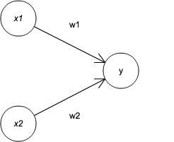

##### オンシャヘイシャ勉強会
# パーセプトロン
+ ローゼンブラット　1957年　アメリカ
+ ニューラルネットワークの起源

## パーセプトロンとは
+ 複数の信号を入力として受け取り、一つの信号を出力

### 2つの信号を入力として受け入れるパーセプトロンの例

+ x1, x2は入力信号、yは出力信号、w1, w2は重み
+ ◯は「ニューロン」、「ノード」と呼ばれる
+ 入力信号はニューロンに送られる際に固有の重みが乗算される
+ ニューロンでは、送られてきた信号の総和が計算され、ある限界値を超えた場合にのみ1を出力
+ 限界値のことを「閾値」と呼び、θという記号で表現
+ 式で表すと

## 単純な論理回路
### ANDゲート
+ ANDゲートとは、2入力1出力のゲート
+ 以下のような真理値表となる

| x1 | x2 |  y |
|:--:|:--:|:--:|
|  0 |  0 |  0 |
|  1 |  0 |  0 |
|  0 |  1 |  0 |
|  1 |  1 |  1 |

+ パーセプトロンで表現　→　真理値表を満たすようなw1,w2,θの値を決める
+ ANDゲートを満たす組み合わせは無限 
    + (w1, w2, θ) = (0.5, 0.5, 0.7)
    + (w1, w2, θ) = (1, 1, 1)

### NANDゲート
| x1 | x2 |  y |
|:--:|:--:|:--:|
|  0 |  0 |  1 |
|  1 |  0 |  1 |
|  0 |  1 |  1 |
|  1 |  1 |  0 |
+ NANDゲートを満たす組み合わせは？

### ORゲート
| x1 | x2 |  y |
|:--:|:--:|:--:|
|  0 |  0 |  0 |
|  1 |  0 |  1 |
|  0 |  1 |  1 |
|  1 |  1 |  1 |
+ ORゲートを満たす組み合わせは？

#### 同じ構造のパーセプトロンがパラメータを挑戦するだけで全て表現できる

## パーセプトロンの実装
### 簡単な実装
+ ANDゲートをx1,x2を引数とするAND関数を実装してみよう
    + w1, w2, thetaは関数内で初期化

### 重みとバイアスの導入
+ 別の実装方法へ修正

+ bをバイアス、w1, w2は重み
+ NumPyでの実装をインタプリタで確認

    >> import numpy as np
    >> x = np.array([0, 1])     # 入力
    >> w = np.array([0.5, 0.5]) # 重み
    >> b = -0.7                 # バイアス
    >> w * x
    array([0., 0.5])
    >> np.sum(w*x)
    0.5
    >> np.sum(w*x) + b
    −0.19999999999             # おおよそ-0.2

### 重みとバイアスによる実装
+ ANDゲート、NANDゲート、ORゲートを実装してみよう

## パーセプトロンの限界
### XORゲート
+ 排他的論理和

| x1 | x2 |  y |
|:--:|:--:|:--:|
|  0 |  0 |  0 |
|  1 |  0 |  1 |
|  0 |  1 |  1 |
|  1 |  1 |  0 |

### 線形と非線形

## 多層パーセプトロン
### 既存ゲートの組み合わせ

| x1 | x2 | s1 | s2 |  y |
|:--:|:--:|:--:|:--:|:--:|
|  0 |  0 |  1 |  0 |  0 |
|  1 |  0 |  1 |  1 |  1 |
|  0 |  1 |  1 |  1 |  1 |
|  1 |  1 |  0 |  1 |  0 |

### XORゲートの実装
+ AND,NAND,ORゲートを使ってXORゲートを実装してみよう
+ 多層パーセプトロン

## NANDからコンピュータへ
+ 足し算を行う加算器もパーセプトロンで作成可能
+ 2進数を10進数に変換するエンコーダ
+ NANDからテトリスへ。詳しくは「[コンピュータシステムの理論と実装](http://amzn.to/2fn3oFO)」

## まとめ
ニューラルネットワークの基礎

+ パーセプトロンは入出力を備えたアルゴリズム
+ パーセプトロンでは「重み」、「バイアス」を設定
+ パーセプトロンを用いると論理回路を表現可能
+ XORゲートは単層のパーセプトロンでは表現不可
+ 二層のパーセプトロンを用いればXORゲートも表現可能
+ 単層パーセプトロンは線形領域だけできないが、多層のパーセプトロンを用いれば非線形領域も表現可能
+ 多層のパーセプトロンは（理論上）コンピュータを表現できる