##### オンシャヘイシャ勉強会
#ニューラルネットワーク
## パーセプトロンの復讐
### 良い点
+ コンピュータが行うような複雑な処理も表現可能

### 悪い点
+ 重みを設定するのは人の手

→悪い点を解決するためにニューラルネットワークがある

→具体的にいうと、適切な重みパラメータをデータから自動で解決できる

##　パーセプトロンからニューラルネットワーク
+ 多くの共通点がある

### ニューラルネットワークの例
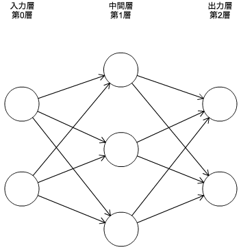

+ ニューロンのつながり方にはパーセプトロンと違いはない
+ キーワード
    + 入力層
    + 中間層（隠れ層）
    + 出力層

### パーセプトロンの復讐
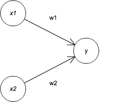

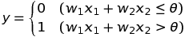

バイアスbを１として図示する。バイアスは固定値のため、差別化するため、灰色に塗った

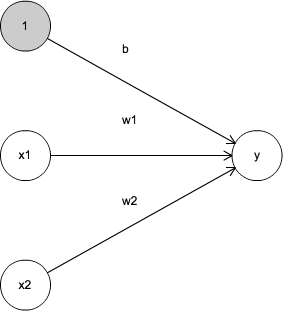

h(x)という関数を導入し、式を変換する

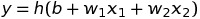

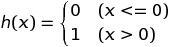

入力信号の総和がh(x)という関数で変換された

### 活性化関数
入力信号の総和を出力信号に変換する関数を一般的に活性化関数と呼ぶ。
活性化関数は入力信号の総和がどのように活性化するか決定する役割がある。
式を書き直すと

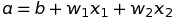

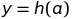

式を図に明示的に表すと

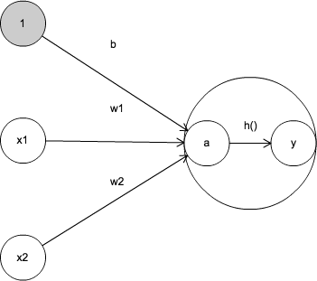

活性化関数は、閾値を境にして出力が切り替わる関数で「ステップ関数」、「階段関数」と呼ばれる。
パーセプトロンでは活性化関数にステップ関数を採用している。

### シグモイド関数
ニューラルネットワークでよく用いられる活性化関数のひとつ。

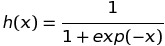

式は難しく見えるが関数なので入力すればなにかしら出力される。
パーセプトロンとの違いは活性化関数のみ。

### ステップ関数の実装
+ Pythonを用いて、ステップ関数を実装しなさい
+ matplotlibを用いてグラフ化しなさい
    + ヒント：np.arangeを使用する

### シグモイド関数の実装
+ Pythonを用いて、シグモイド関数を実装しなさい
+ matplotlibを用いてグラフ化しなさい
    + ヒント：np.arangeを使用する

### シグモイド関数とステップ関数の比較
+ 滑らかさが違う
+ 水で例えるとステップ関数はししおどし、シグモイド関数は水車
+ どんな入力値でも0−1の間に出力を押し込める点は共通
+ 非線形関数であることも共通

### 非線形関数
シグモイド関数は曲線、ステップ関数は階段のような折れ曲がった直線で、ともに非線形な関数に分類。
ニューラルネットワークでは、活性化関数に非線形を用いる必要がある。

### ニューラルネットワークの内積
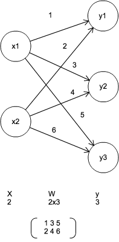

行列を使うことで一度に計算できる
※バイアスと活性化関数は一旦諸略

        >X = np.array([1,2])
        >W = np.array([[1, 3, 5],[2, 4, 6]])
        >Y = np.dot(X, W)
        >print(Y)

### 3層ニューラルネットワークの実装
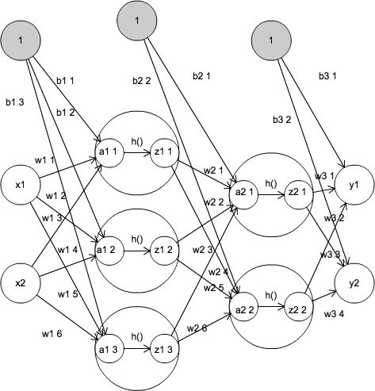

        def init_network():
            network = {}
            network['W1'] = np.array([[0.1, 0.3, 0.5],[0.2, 0.4, 0.6]])
            network['b1'] = np.array([0.1, 0.2, 0.3])
            network['W2'] = np.array([[0.1, 0.4],[0.2, 0.5],[0.3, 0.6]])
            network['b2'] = np.array([0.1, 0.2])
            network['W3'] = np.array([[0.1, 0.3],[0.2, 0.4]])
            network['b3'] = np.array([0.1, 0.2])
            return network

        def forword(network, x):
            W1, W2, W3 = network['W1'],network['W2'],network['W3']
            b1, b2, b3 = network['b1'],network['b2'],network['b3']
            a1 = np.dot(x, W1) + b1
            z1 = sigmod(a1)
            a2 = np.dot(z1, W2) + b2
            z2 = sigmod(a2)
            a3 = np.dot(z2, W3) + b3
            y = a3

            return y

        network = init_network()
        x = np.array([1.0, 5.0])
        y = forword(network, x)
        print(y)

## 出力層
### 分類問題と回帰問題
+ 回帰問題では恒等関数
+ 分類問題ではソフトマックス関数

### 恒等関数とソフトマックス関数
+ 恒等関数はそのまま入力値を出力
+ ソフトマックス関数は以下の式で表される

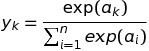

## 手書き数字認識
### MNISTデータセット
### ニューラルネットワークの推論処理
### バッチ処理
### まとめ
+ パーセプトロンと、ニューロンの信号が階層的に伝わるという点で同じ
+ ニューロンへ信号を送信する際に、信号を変化させる活性化関数に大きな違いがある
+ ニューラルネットワークでは活性化関数が滑らかに変化するシグモイド関数、パーセプトロンでは信号が急に変化するステップ関数を使用
+ ニューラルネットワークでは、活性化関数としてシグモイド関数やReLU関数のような滑らかに変換する関数を利用
+ 機械学習の問題は、回帰問題と分類問題に大別できる
+ 出力層で使用する活性化関数は、回帰問題では恒等関数、分類問題ではソフトマックス関数を一般的に利用する
+ 分類問題では、出力層のニューロンの数を分類するクラス数に設定
+ 入力データのまとまりをバッチと言い、バッチ単位で推論処理を行うことで、計算を高速に行える